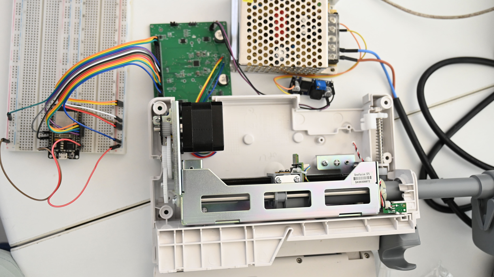
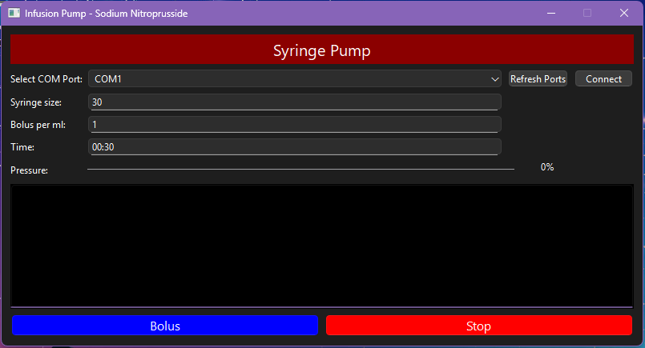
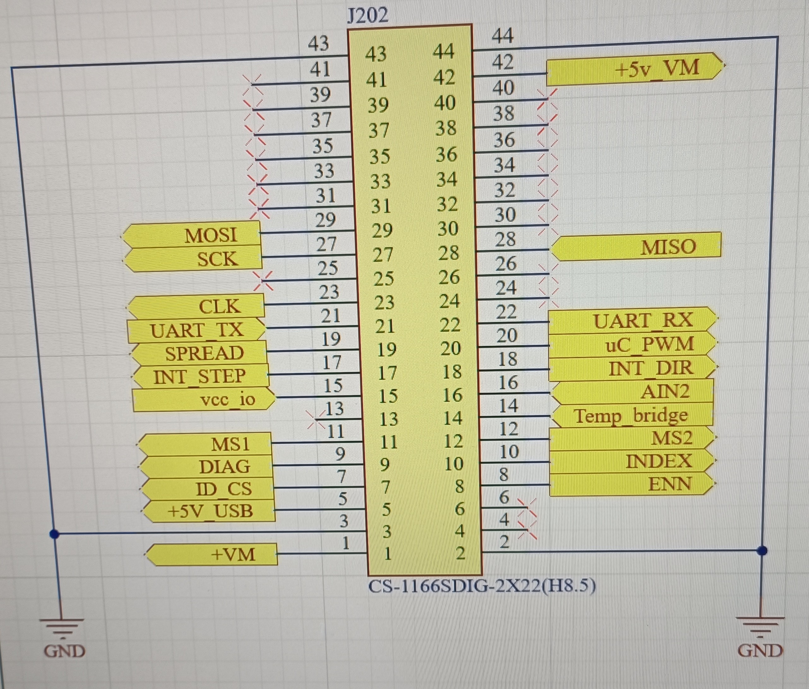

# Syringe Pump — ESP32 + TMC2209

[](LICENSE)

Firmware + hardware control for a syringe pump using **ESP32** + **TMC2209** stepper driver.




## Overview

This project implements the firmware and control interface for a syringe pump using an ESP32 microcontroller and a TMC2209 stepper driver. The aim is to precisely control a stepper motor to push/pull a syringe with configurable flow rates and volumes.

Typical use cases include microfluidics, lab automation, and medical prototyping.

## Features

- Control of stepper-driven syringe pump via ESP32  
- Uses TMC2209 stepper driver (UART / step/direction interface)  
- Configurable parameters (flow rate, steps per µL, acceleration, limits)  
- Modular firmware design


## Hardware Requirements

- ESP32 development board  
- TMC2209 stepper driver (Used TMC2209-EVAL in our experiment)  
- Stepper motor (Used NEMA17 200 steps/rev)  
- Support Syringe Sizes 1, 3, 5, 10, 20, 30 and 60 ml
- Power supply
- (Optional) limit switches, sensors

### Wiring Example



| Signal            | ESP32 Pin | TMC2209 Pin | Notes |
|-------------------|-----------|--------------|-------|
| UART TX           |    TX2    | RX           | UART communication |
| UART RX           |    RX2    | TX           | UART communication |
| Step              | GPIO 14   | STEP         | Step pulses |
| Direction         | GND/VCC   | DIR          | Check on the direction, no need to reverse it |
| Enable            | GPIO 5    | EN           | Enable pin |
| Motor coils       | —         | A+/A−, B+/B− | Motor connections |
| Power supply      | —         | Vmotor, GND  | Motor power |

## Software Setup

### Prerequisites

- Arduino IDE / PlatformIO / ESP-IDF  
- ESP32 board package  
- Required libraries (TMCStepper, AccelStepper, etc.)

### Build & Upload

```bash
git clone https://github.com/Amjad20/Syringe-Pump-ESP32-TMC2209.git
cd Syringe-Pump-ESP32-TMC2209/ESP32
# Open and compile using Arduino IDE or PlatformIO
```

## Example Commands

```bash
SET_RATE 100      # Set flow rate (µL/min)
INFUSE 500        # Dispense 500 µL
WITHDRAW 200      # Withdraw 200 µL
STOP              # Stop pump
STATUS            # Read pump status
```

## Calibration

1. Measure the volume moved per number of steps  
2. Adjust `steps_per_ul` in firmware  
3. Test accuracy at different speeds and volumes

## Safety

- Use end-stop sensors to avoid damage  
- Don’t exceed torque/current ratings  
- Include emergency stop function

## Troubleshooting

| Issue | Cause | Solution |
|-------|--------|-----------|
| Motor not moving | Wrong wiring / pins | Check connections |
| Skipping steps | Too high speed | Lower speed or acceleration |
| Overheating | Too high current | Lower driver current |
| Inaccurate volume | Calibration error | Recalibrate steps per µL |

## Authors

Created by **Amjad20** & **Mohammed Alkaylani**  
© 2025 — Open Hardware Project

## License

This project is licensed under the **MIT License** — see the [LICENSE](LICENSE) file for details.
